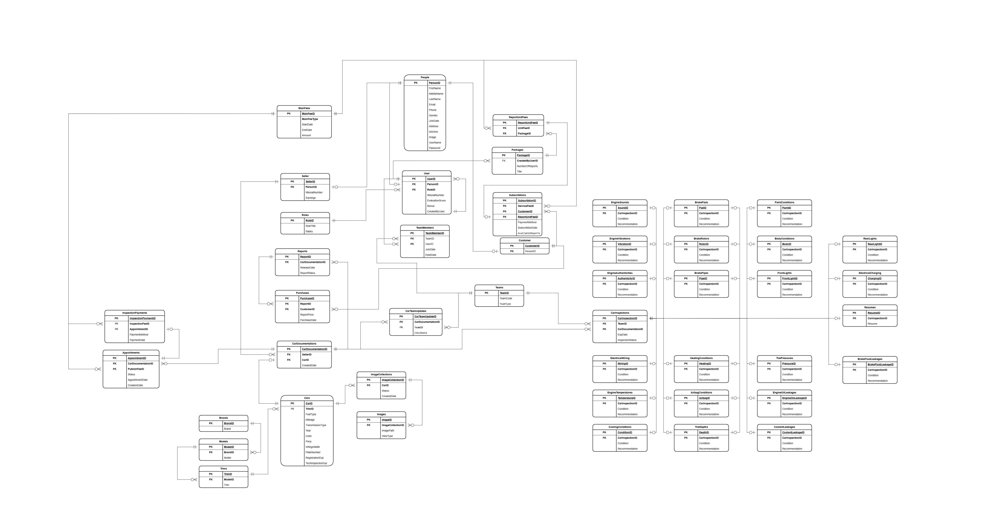

# 🚗 CarJen – Inspection & Report Management System (Modern Backend 2025)

---

## 🧾 Overview

**CarJen** is a smart backend system designed to **secure and professionalize the used car market in Algeria** through structured vehicle inspections and transparent report sharing.

Originally built in 2024 using **.NET Framework** and **ADO.NET**, the backend has been **rebuilt with ASP.NET Core and EF Core** for modern scalability, maintainability, and clean architecture.

📎 [GitHub Repository](https://github.com/KhaledAnsar-dev/CarJen-Backend-Framework-2024)

---

## ⚙️ Technology Stack

* **ASP.NET Core 8.0** – Web API
* **Entity Framework Core 9.0**
* **DTO-based communication**: `CreateDto`, `UpdateDto`, `ResponseDto`, `InnerDto`
* **Manual mapping** & **Mapster**
* **Optimized LINQ projections**
* **EF Core with stored procedures**
* **API-first design** – suitable for:

  * Web clients (React, Angular)
  * Mobile apps
  * Desktop clients (WinForms, WPF)

---

## 🧠 Business Vision

Backed by a **marketing-driven perspective**, CarJen aligns both technical and commercial goals to bring trust and structure to Algeria’s used car market.

### 🔍 Market Challenges

* Lack of inspection standards
* Low trust between buyers and sellers
* Limited access to verified information

### 🧩 CarJen’s Solution

* Third-party inspection reports
* Role separation: buyer vs. seller
* Credit-based access to verified reports

---

## 💼 Business Model

* **Sellers**: Pay for inspections, receive reports

* **Buyers**: Use **virtual stars** to access reports

* **Revenue Streams**:

  * Inspection fees
  * Report publication
  * Star package sales
  * Buyer access fees

* **Seller Incentive**: Partial refund when a buyer views a report

---

## 📦 Future Roadmap

✅ **Current**: CarJen-operated garages ensure quality and price control
🚀 **Planned**:

* Partner garages under CarJen certification
* E-commerce portal for:

  * Auto parts & accessories
  * Car-related services
* B2B integration with automotive players

---

## 🗂️ Database

* Based on a mature relational schema (46+ tables)
* Migrated from ADO.NET to **EF Core (Database-First)**
* Includes stored procedures for optimized operations

---

## 🔗 Related Projects

* 🧱 **Legacy Backend (2024)** – [ADO.NET, 3-tier structure](https://github.com/KhaledAnsar-dev/CarJen-Backend-Framework-2024)
- 🖥️ **CarJen WinForms UI (Desktop Client)**  
  A hybrid desktop application built with **WinForms (.NET Framework)** that interacts with:
  - the **legacy backend** via direct **DLL reference (assembly reference)**  
  - the **modern backend** via **HTTP Web API** endpoints  
  📎 [View on GitHub](https://github.com/KhaledAnsar-dev/CarJen-UI-Desktop)

---

## 📌 Project Status

This backend is the **active, maintained, and production-ready version** of CarJen, replacing the legacy ADO.NET implementation.