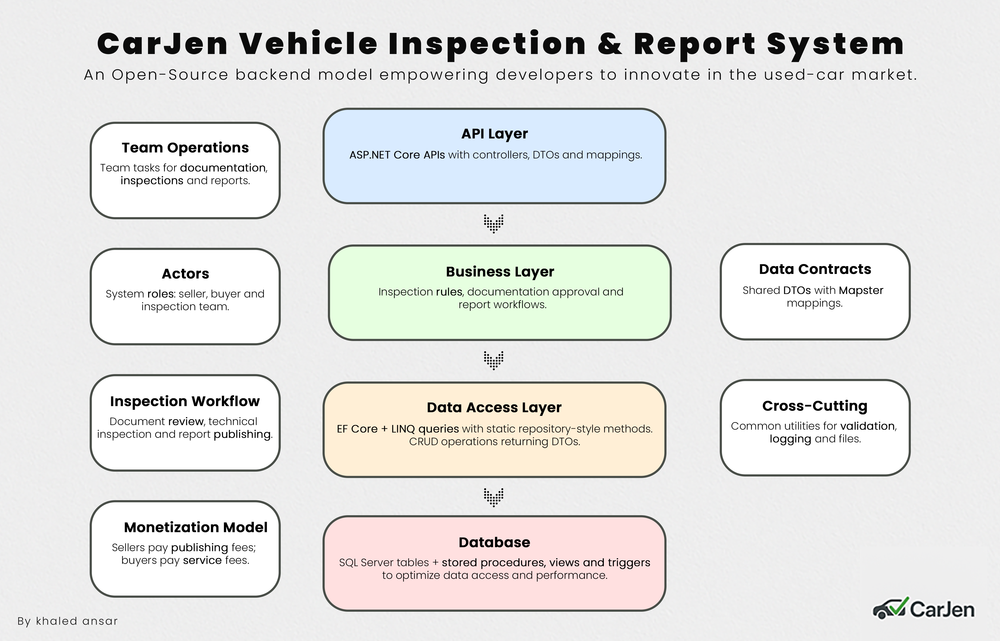
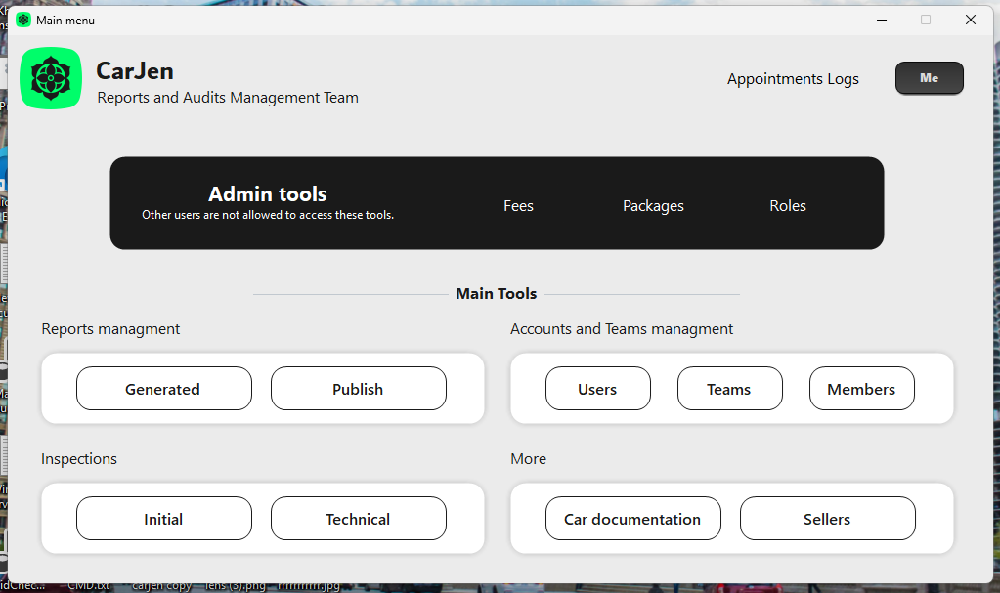
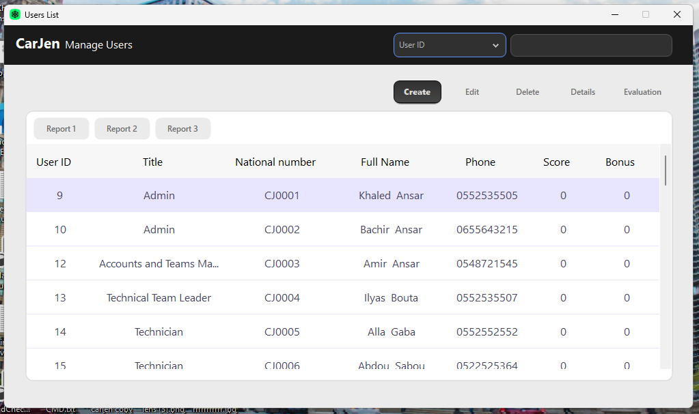
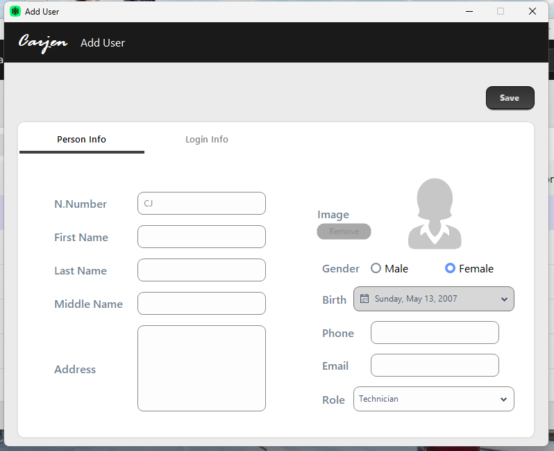
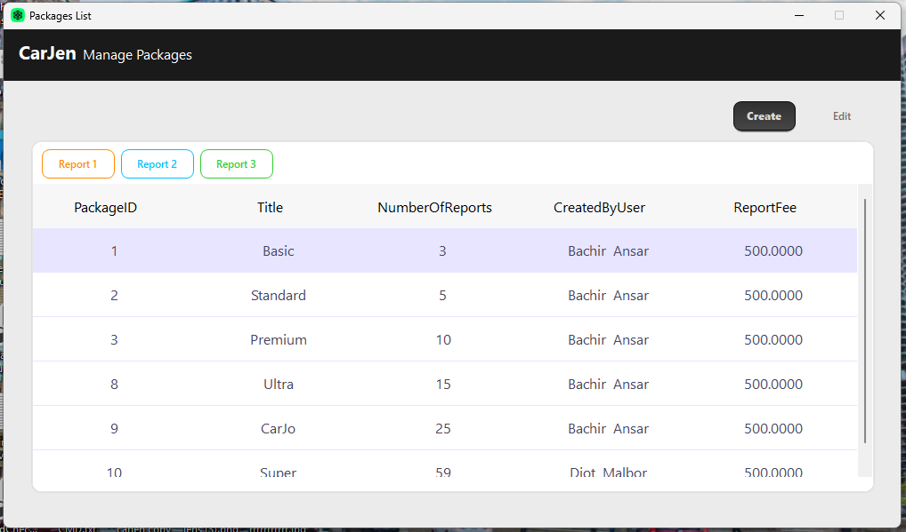
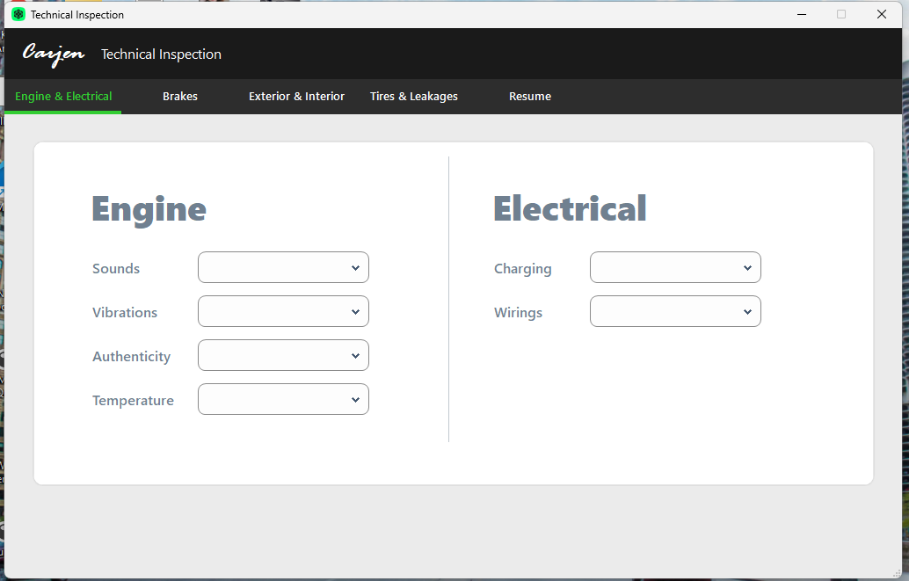
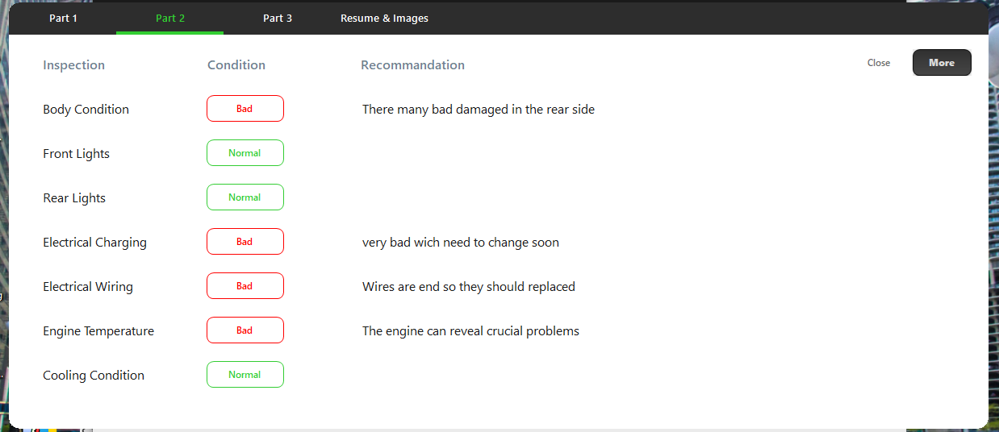

---

# 🚗 CarJen — MVP API for Transparent Used‑Car Reports

CarJen is a platform idea before it is a technical system.
It was originally designed to solve a real problem in the used‑car market: **how to bring transparency into buying and selling used cars** through trusted, verifiable inspection reports.

This repository does **not** represent the full commercial product — it represents the **MVP backend**, the technical core that powers the idea.
It is published as open source to share the experience of transforming a market concept into real backend architecture, and to help developers build more affordable, more practical alternatives for similar markets.

---

## 🧠 Why This Project Was Shared as Open Source

Building a complete inspection marketplace is expensive and requires garages, partnerships, and large operational models.
But the **technical backbone** — the logic of inspections, reports, fees, roles, approvals, and credits — can still be useful to developers so they can:

- study how a market idea becomes structured backend logic
- reuse or extend the workflow architecture
- build cheaper, simpler versions of similar systems
- explore new ideas for trust and verification markets

For a deeper explanation of the business idea, read the landing page:
👉 [**https://carjen-landing.netlify.app/**](https://carjen-landing.netlify.app/)

---

## 📘 What This Project Is Really About

CarJen started from one question:

> **"How do we bring transparency into used‑car sales using a structured technical system?"**

To answer it, the system needed more than CRUD tables.
It needed:

- Modeling roles: **seller, buyer, inspection team**
- Handling **21 technical checks** per car
- Managing **appointments, approvals, and fees**
- Controlling **report publishing and lifecycle**
- Designing a **credit system (stars)** for buyers to unlock reports

This MVP demonstrates how these market rules become **real APIs**, ready for any client (desktop, web, mobile).

---

## 🧩 Core Modules Implemented in the MVP

### **1. Seller Workflow**

- Book inspection appointments
- Upload and validate documentation
- Approve technical inspection results
- Publish or unpublish their car reports

### **2. Technical Team Workflow**

- Validate submitted documents
- Perform and record **21 technical checks**
- Update car inspection statuses
- Manage team members & roles

### **3. Buyer Credit System (Stars)**

- Buyers purchase stars via packages
- Each star unlocks **one report**
- Stars are **non‑refundable** after use
- Designed to allow affordable browsing of multiple cars

### 4. **Pricing & Fees Engine**

Four types of fees:

- **Seller**: inspection fee
- **Seller**: publishing fee
- **Buyer**: report unlocking fee — **star**
- **Buyer:** service fee **— browsing and buying reports**

### **5. Report Publishing Logic**

- Reports belong to the seller
- Buyers purchase access
- Reports can be **published, paused, or removed**
- Purchased reports are **temporarily** reserved.

### **6. Appointment & Workflow Management**

- Schedule inspection
- Documentation approval stage
- Technical inspection stage
- Final seller approval
- Publish/Unpublish

---

## 🔌 API Samples

APIs cover operations such as:

- Get all appointments
- Get appointment by ID or documentation ID
- Update inspection statuses
- Record technical results
- Publish/unpublish reports
- Manage packages and fees

Each API returns structured DTOs and follows clear validation rules.

---

## 🖥 Client Integration

CarJen includes a **WinForms desktop client** designed to simulate the inspection workflow and validate the system during development.

The system will later support:

- Web interfaces (React)
- Mobile clients
- Additional buyer/seller features

---

## 📸 Screenshots of WinForms desktop client

  
  
  
  

---

## 📁 Database Schema

---

## 🧩 Technologies

- ASP.NET Core 8.0 – Web API
- Entity Framework Core 9.0
- ADO.NET
- SQL Server
- N‑Tier Architecture
- WinForms
- Guna2 Framework

---

## 🛠 Evolution of the Project

- The earliest version of CarJen was built on **.NET Framework**
- Rebuilt with **ASP.NET Core + EF Core — the current version.**
- A **Worker Service** was added to automate background tasks

CarJen **continues** to evolve as a technical exploration of how to automate transparency in used‑car markets.

---

### 🙌 Closing Thoughts

**CarJen** was built to explore how solid backend design can bring structure and transparency to **used‑car sales**.

If it **inspires** you or helps you **learn**, that's already more than enough.

Feel free to **fork** it, **extend** it, or use it in your own learning journey — that's the spirit of **open source**.
